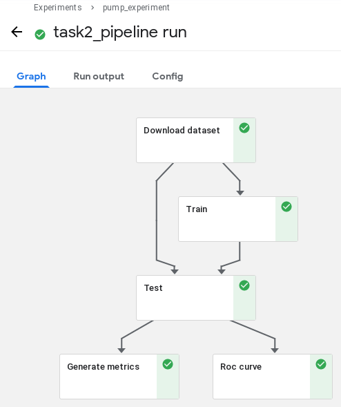
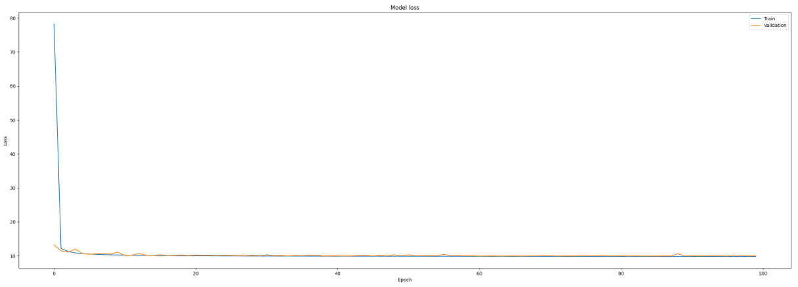
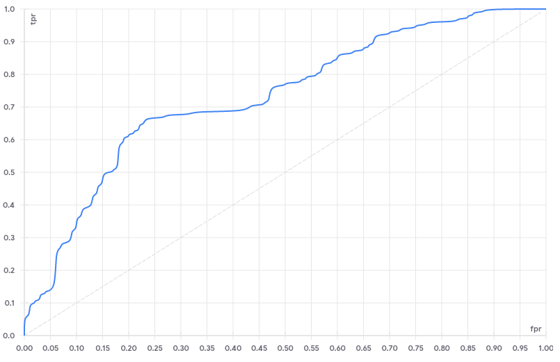

# SAME Example: Anomalous sound detection (ASD) with Kubeflow Pipeline

[](https://github.com/SAME-Project/example-kubeflow-dcase/actions/workflows/quality.yaml) [](https://github.com/SAME-Project/example-kubeflow-dcase/actions/workflows/test.yml) [](CODE_OF_CONDUCT.md)

**TL;DR;** Reproducible condition monitoring project using Kubeflow and SAME, in a single command

- [Installing / Getting Started](#installing--getting-started)
  * [Pipeline Parameters](#pipeline-parameters)
  * [Pipeline Stages](#pipeline-stages)
- [Experimental Results](#experimental-results)
  * [Input parameters](#input-parameters)
  * [Loss plot](#loss-plot)
  * [ROC Curve](#roc-curve)
  * [Metrics](#metrics)
- [Developing](#developing)
  * [Testing](#testing)
- [Known Issues](#known-issues)
  * [M1 Mac Install](#m1-mac-install)
- [Contributing](#contributing)
- [Credits](#credits)

Anomalous sound detection (ASD) is the task of identifying whether the sound emitted from a machine is normal or anomalous. Automatic detection of mechanical failure is essential technology in the fourth industrial revolution, including artificial intelligence (AI)-based factory automation. Prompt detection of machine anomalies by observing sounds is useful for machine condition monitoring.

## Installing / Getting Started

Create a working SAME installation by [following instructions found in the wiki](https://github.com/azure-octo/same-cli/wiki/Epic-Sprint-1-Demo), but stop before the "Run a program" section. Then run the following commands:

```bash
git clone https://github.com/SAME-Project/example-kubeflow-dcase
cd example-kubeflow-dcase
same program create -f same.yaml
same program run -f same.yaml --experiment-name example-kubeflow-dcase --run-name default
```

Now browse to your kubeflow installation and you should be able to see an experiment and a run.

### Pipeline Parameters

| Pipeline parameter | Description |
| ------ | ------ |
|dataset_url | url of the dataset (e.g https://zenodo.org/record/3678171/files/dev_data_fan.zip)|
|max_fpr| Float between 0 and 1. The standardized partial AUC over the range [0, max_fpr] is returned|
|feature_n_mels| Integer representing the number of mels (e.g 128)|
|feature_frames| Integer representing the number of frames of the FFT window(e.g 5)|
|feature_n_fft| Integer representing the length of the FFT window (e.g 1024)|
|feature_hop_length| Integer representing the number of samples between successive frames (e.g 512)|
|feature_power| Float representing the exponent for the magnitude melspectrogram. (e.g., 1.0 for energy, 2.0 for power, etc )|
|fit_compile_optimizer| String (name of optimizer) or optimizer instance. See tf.keras.optimizers. (e.g "adam")|
|fit_compile_loss| String (name of objective function) or tf.keras.losses.Loss instance. See tf.keras.losses (e.g "mean_squared_error")|
|fit_epochs| Integer. Number of epochs to train the model. (e.g 50)|
|fit_batch_size| Integer or None. Number of samples per gradient update(e.g 512)|
|fit_shuffle| Boolean (whether to shuffle the training data before each epoch)|
|fit_validation_split| Float between 0 and 1. Fraction of the training data to be used as validation data(e.g 0.1)|
|fit_verbose| 0, 1, or 2. Verbosity mode. 0 = silent, 1 = progress bar, 2 = one line per epoch|

The url of the dataset should lead to a dataset that has the following structure:

    /machine( Toy_Car / fan / slider ...)
        /train (Only normal data for all Machine IDs are included.)
            /normal_id_01_00000000.wav
            ...
            /normal_id_01_00000999.wav
            /normal_id_02_00000000.wav
            ...
            /normal_id_04_00000999.wav
        /test (Normal and anomaly data for all Machine IDs are included.)
            /normal_id_01_00000000.wav
            ...
            /normal_id_01_00000349.wav
            /anomaly_id_01_00000000.wav
            ...
            /anomaly_id_01_00000263.wav
            /normal_id_02_00000000.wav
            ...
            /anomaly_id_04_00000264.wav

Some options for the dataset url are:

* Fan dataset: https://zenodo.org/record/3678171/files/dev_data_fan.zip
* Toy-car dataset:https://zenodo.org/record/3678171/files/dev_data_ToyCar.zip
* Slider rail dataset: https://zenodo.org/record/3678171/files/dev_data_slider.zip
* Toy-conveyor dataset: https://zenodo.org/record/3678171/files/dev_data_ToyConveyor.zip
* Valve dataset: https://zenodo.org/record/3678171/files/dev_data_valve.zip
* Pump dataset: https://zenodo.org/record/3678171/files/dev_data_pump.zip

### Pipeline Stages



#### 1. Download dataset ([code](./src/download.py))
This component, given the dataset url, downloads all its contents inside an OutputPath Artifact.

#### 2. Train ([code](./src/train.py))
This component performs the following operations:

    1. Given an InputPath containing the previously downloaded dataset, extracts all the training files (audio), converting them into numeric arrays.
    2. Uses those arrays, trains a model with the specified parameters.
    3. Save the model in an OutputPath Artifact.
    4. Generate a loss plot, saves it in an OutputArtifact and embed its visualization inside a web-app component.

#### 3. Test ([code](./src/test.py))
This component performs the following operations:

    1. Loads the previously saved model through an InputPath Artifact.
    2. Given an InputPath containing the previously downloaded dataset, extracts all the testing files (audio), converting them into numeric arrays.
    3. Uses those arrays to test the model.
    4. Saves the  inside a file generated as an OutputPath Artifact(results_path).
    5. Saves true labels and predicted scores to pass it later to the ROC curve.
    6. Saves the name, AUC and pAUC for each subgroup of the test into a results OutputPath Artifact.
    7. Saves the scores for the anomalies files of the test into a anomaly_dir OutputPath Artifact.
    6. Saves accuracy as metrics that will later be passed to the Metrics component.

#### 4.1. ROC Curve ([code](./src/roc_curve.py))
This component is passed the labels directory, which contains true labels and predicted scores, and generates a roc curve that the kubeflow UI can understand. This function can be reused in other pipelines if given the appropiate parameters.

#### 4.2. Metrics ([code](./src/metrics.py))
This component is passed the mlpipelinemetrics which contains metrics and generates a visualization of them that the kubeflow UI can understand.

## Experimental Results

In this section we will replicate the results for the pump dataset in the [DCASE 2020 Challenge Task 2 "Unsupervised Detection of Anomalous Sounds for Machine Condition Monitoring"](https://github.com/y-kawagu/dcase2020_task2_baseline/README.md).
The pipeline outputs are a loss plot, a roc curve, and different metrics, from which metrics can be directly compared.
We can see them in the visualizations of the pipeline or in the Run Output Tab of the Run.

In order to check the validity of the pipeline, we are going to execute a run with the same parameters as the original experiment and compare the outputs with the ones obtained in [the original code](https://github.com/y-kawagu/dcase2020_task2_baseline).

### Input parameters ###
| Pipeline parameter | Value |
| ------ | ------ |
|dataset_url |
https://zenodo.org/record/3678171/files/dev_data_pump.zip|
|max_fpr|0.1|
|feature_n_mels|128|
|feature_frames|5|
|feature_n_fft|1024|
|feature_hop_length|512|
|feature_power|2.0|
|fit_compile_optimizer|adam|
|fit_compile_loss|mean_squared_error|
|fit_epochs|100|
|fit_batch_size|512|
|fit_shuffle|True|
|fit_validation_split|0.1|
|fit_verbose|1|

### Loss plot ###



### ROC Curve ###



### Metrics ###
The original results are shown in https://github.com/y-kawagu/dcase2020_task2_baseline#7-check-results. In particular, the results for the pump task are:

| id | AUC | pAUC
| ------ | ------ | ------ |
|0	|	0.670769 |	0.57269 |
|2	|	0.609369 |	0.58037 |
|4	|	0.8886	 |	0.676842 |
|6	|	0.734902 |	0.570175 |

In our replication, we get similar results (our results are in percentage format):

| id | AUC | pAUC
| ------ | ------ | ------ |
|0	|	67.126%	|	56.570% |
|2	|	60.991%	 |	58.037%	|
|4	|	88.490%	 |  66.947% |
|6	|	73.324%	 |  56.966%	|

If we increase the number of epochs to 150, and the validation split to 0.15, the results improve a little:

| id | AUC | pAUC
| ------ | ------ | ------ |
|0	|	68.336% |	57.085%	|
|2	|	63.468% |	58.321% |
|4	|	87.260% |   64.158%	|
|6	|	72.716% |   58.153% |


## Developing

When attempting to run or test the code locally you will need to install the reqiured libraries (this requires [poetry](https://python-poetry.org)).

```bash
make install
```

### Testing

This repo is not a library, nor is it meant to run with different permutations of Python or library versions. It is not guaranteed to work with different Python or library versions, but it might. There is limited matrix testing in the github action CI/CD.

```bash
make tests
```

## Known Issues

### M1 Mac Install

This currently does not work because of `librosa`, which depends on llvmlite and [does not have aarch support](https://github.com/numba/llvmlite/issues/665).

As of scipy `1.6.3` you'll need to add some workarounds to get it to build.

```
brew install openblas
export OPENBLAS=$(brew --prefix openblas)
export CFLAGS="-falign-functions=8 ${CFLAGS}"
poetry install
```

## Contributing

See [CONTRUBUTING.md](CONTRIBUTING.md).

## Credits

This project was delivered by [Winder Research](https://WinderResearch.com), an ML/RL/MLOps consultancy.

This repository is inspired by [dcase2020_task2_baseline](https://github.com/y-kawagu/dcase2020_task2_baseline) under the [MIT License](https://github.com/y-kawagu/dcase2020_task2_baseline/blob/master/LICENSE) whose main goals are "Unsupervised Detection of Anomalous Sounds for Machine Condition Monitoring".
